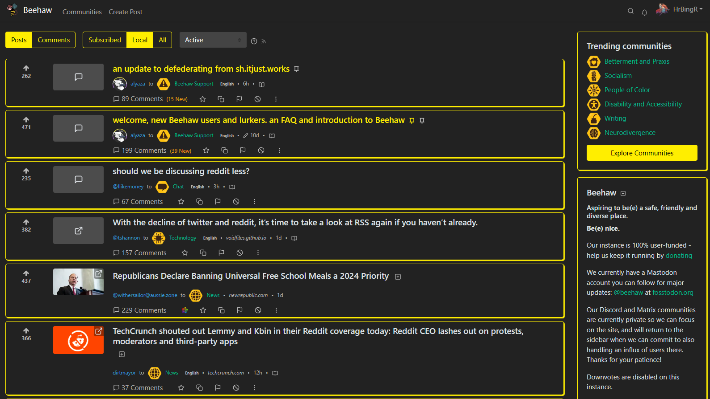

# Lemmy_CSS

This serves as a repository for hosting and providing on and working on custom CSS for any Lemmy instance that makes use of the default litely and darkly Lemmy themes.

With the use of a custom CSS browser extension (such as Amino for Edge/Chrome) you can use any of the templates housed within this repo for the purposes of theming your Lemmy experience to your liking.

Users of the Stylus extension can also easily install the theme via the [userCSS file here](https://github.com/HrBingR/Lemmy_CSS/raw/main/themes/lemmy_css.user.css).

Feel free to contribute your own CSS as well; the more themes the better!

Side note: This is more aimed at users of Lemmy, rather than devs or people hosting their own instances. While I'm sure these themes could be used by instance owners to offer more theme options, my goal here was to provide themes that users could make use of without needing the instance owner to implement anything.

Themes in the litely folder are to be used with the litely Lemmy theme, while themes in the darkly folder are to be used with the darkly Lemmy theme.

An example of the blue theme:

An example of the yellow darkly theme:

